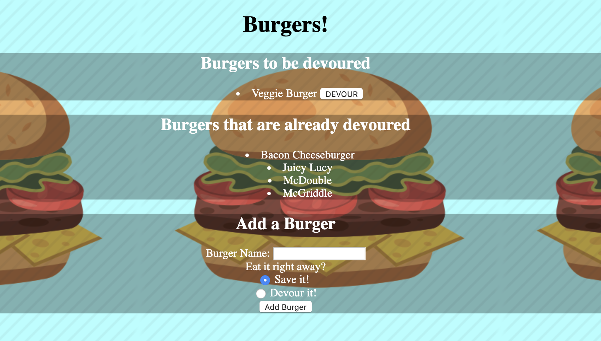

# Burger

* This application was made to practice what I have learned with handlebars. It is a variation of the popular "Eat Da Burger" app. The user can input a burger to save for later or devour immediately. After submitting the burger name the burger is categorized into either the eaten or to be eaten section. In the to be eaten section, the user has the option to switch the status of a burger to eaten, thus switching it to the eaten section.

## Technologies used (Run "npm i" to install packages):

* HTML
* CSS
* JavaScript
* JQuery
* Node.js 
* Express.js
* Express-Handlebars
* MySQL
* Heroku

## Author: Gabriel Jacobs
